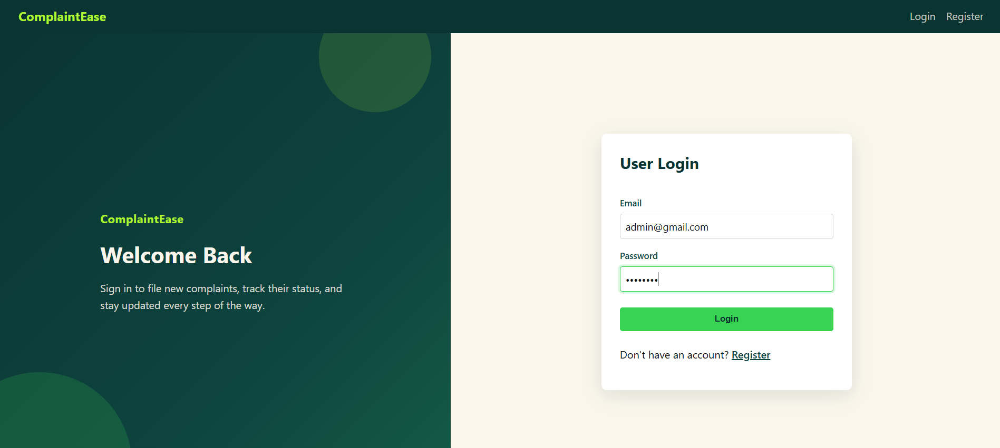
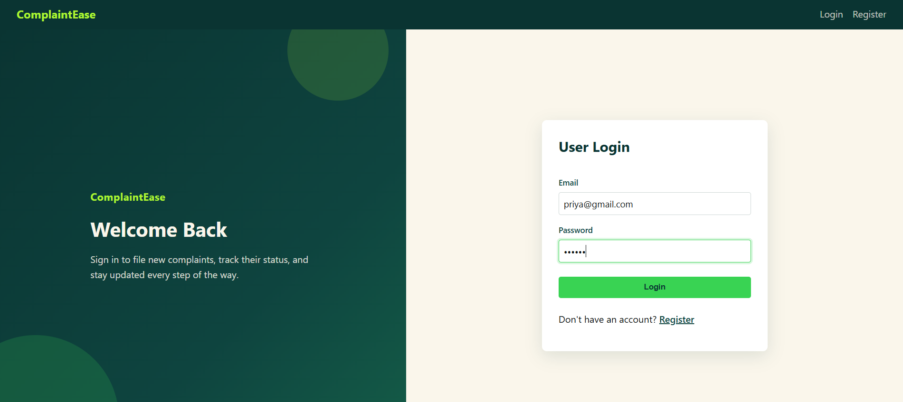
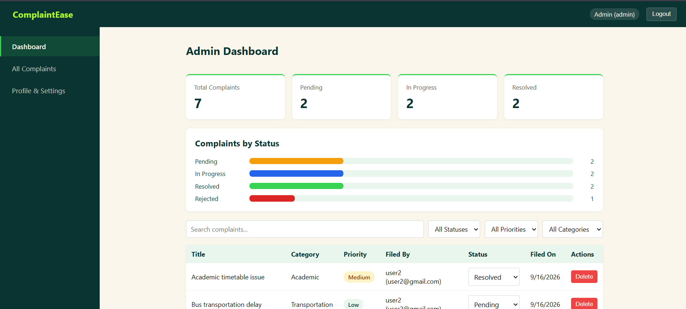
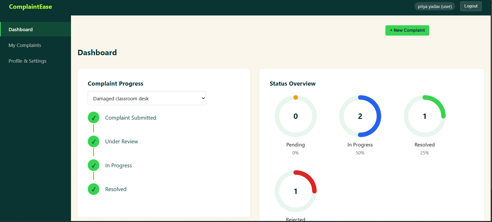
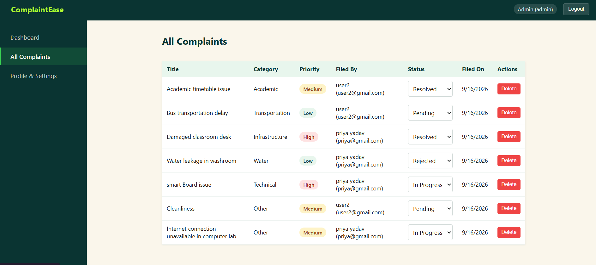
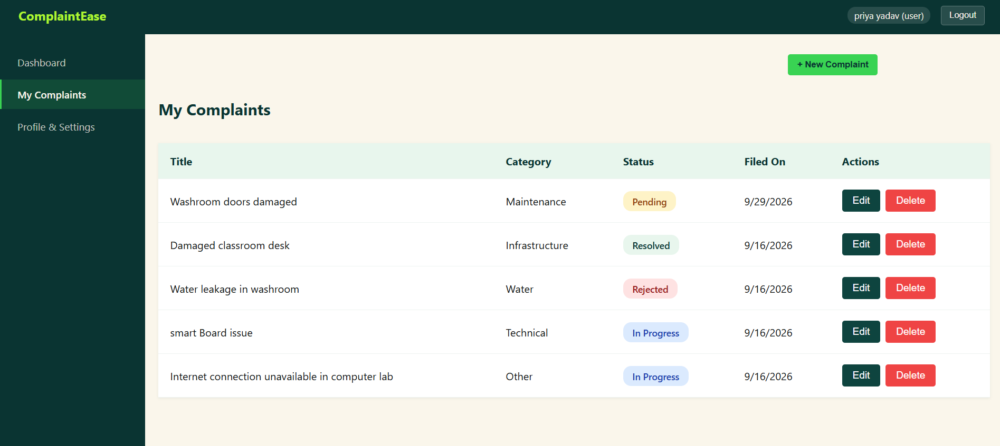
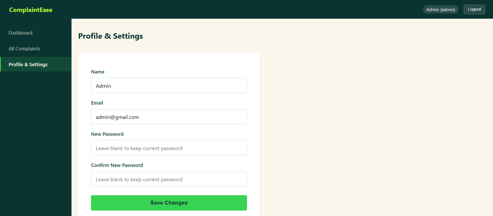

# ComplaintEase

A full-stack complaint management system.

- **Backend**: Node.js, Express, MongoDB (Mongoose), JWT auth
- **Frontend**: React (Vite), React Router, Axios

## Features
- User registration & login (JWT-based)
- Users can file complaints and see only their own
- Admins can see all complaints, update status, and add remarks
- Complaint owners can delete their own complaint while it's still "Pending"

## Project structure
```
ComplaintEase/
├── backend/     - Express REST API
└── frontend/    - React (Vite) client
```

## Screenshots
### Login Page



### Dashboard



### All Complaints



### My Complaints


### Profile & Settings


See the setup guide provided alongside this project for step-by-step run instructions.
